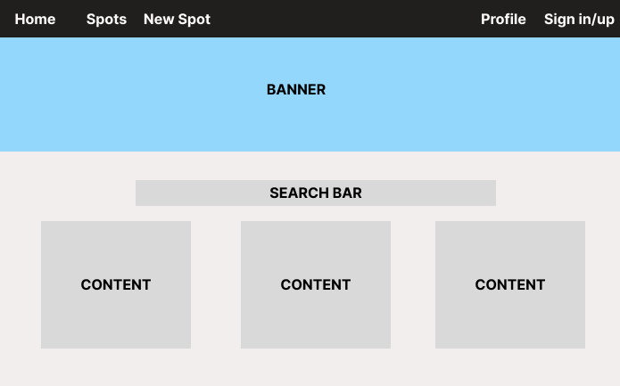
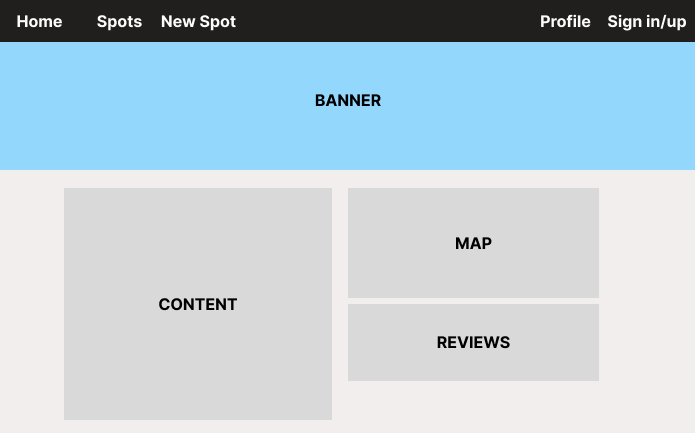
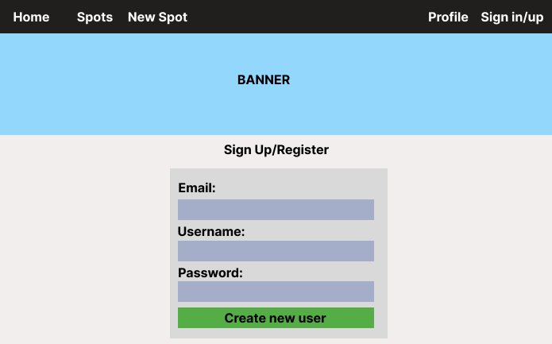
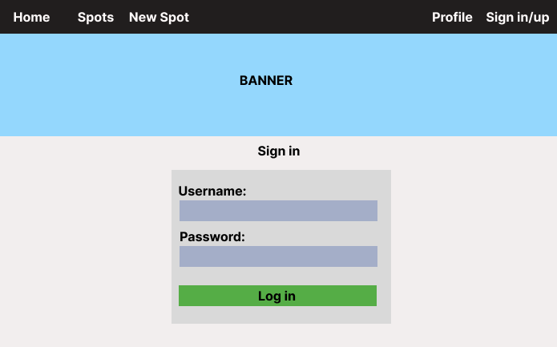
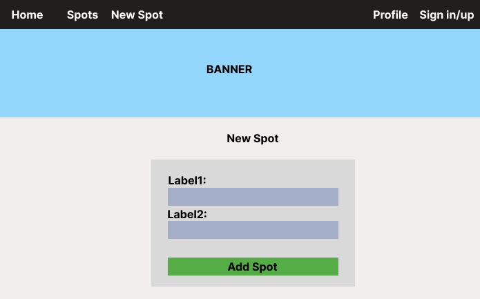
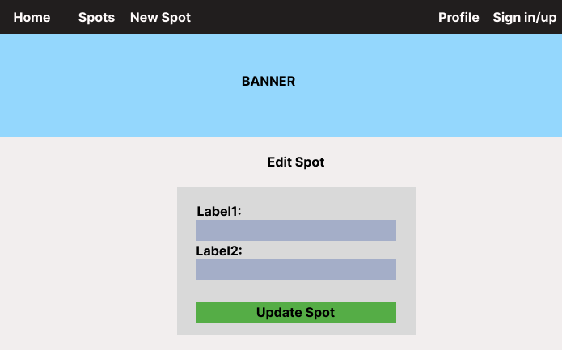

# RockyMountain Waterways

#### My first full-stack application. 

## Description
The Rocky Mountain Waterways app is a digital guide to explore the diverse water bodies in Colorado. From the mighty rivers to serene mountain lakes, this app helps you choose your next aquatic adventure.

## Table of Contents
* [Technologies Used](#technologiesused)
* [Features](#features)
* [Design](#design)
* [Project Next Steps](#nextsteps)
* [Deployed App](#deployment)
* [About the Author](#author)

## Technologies Used
* Node JS
* Express
* EJS
* JavaScript
* Bootstrap
* CSS3

## Features
* Discover Water Activity Spots: Explore a diverse range of water bodies across Colorado. From adventurous rivers to serene mountain lakes, find the perfect spots for your favorite water activities.
* Browse and Share Places: Discover new spots and share your favorite water activity spots with the community. Use the app to create, edit, update, and delete entries, ensuring an up-to-date and collaborative guide for fellow water enthusiasts.
* Activities at a Glance: Get insights into the activities available at each spot. Whether it's kayaking, fishing, or simply enjoying a peaceful swim.

## Whiteboard Images
* Index Page

* Show Page

* Register Page

* Login Page

* New Page

* Edit Page

## Planning
* Trello

## Design
* Design elements implemented using Bootstrap 5.3, EJS, and CSS3. 

## Project Next Steps
* Enhanced Search Functionality: Implement advanced search filters to refine results.
* Interactive Map Integration: Elevate user experience by implementing an interactive map feature. Add a pin for each water activity location, allowing users to visually explore and select spots directly on the map.
* Real-Time Updates: Enable real-time updates on the map as users create, edit, or delete water activity spots. 

## Deployed Link
[RockyMountain Waterways](https://rockymountainwaterways-project.onrender.com/)

* You can view the repository:
[Github.com](https://github.com/karolbgm/rmww-project)
    

## About The Author
I am a passionate software engineer with a flair for transformation. In my previous career as a chemical engineer and administrative assistant I honed my adaptability and attention to detail to solve problems. I orchestrate efficiency in any role I take on and as a Full Stack Software Engineer, I blend creativity and precision to build digital solutions that bridge borders and cultures.
